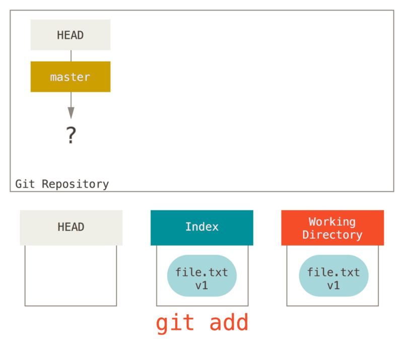

# 在终端使用Git

*吕钰麟  2024.3.25*

### 学习Git的一些参考资料

- [参考书籍：Pro Git book](https://git-scm.com/book/zh/v2)
- [Linus 在2007年Google Talk上介绍Git](https://www.bilibili.com/video/BV1xb411A7ac)
- [GitHub官方帮助文档和教程](https://docs.github.com/zh/get-started)
- [一图总结Git和GitHub常用命令（Cheatsheet）](https://posit.co/wp-content/uploads/2022/10/git-github.pdf)
- [通过小游戏学习Git分支：Learn Git Branching](https://learngitbranching.js.org/?locale=zh_CN)
- [通过本地客户端使用GitHub：GitHub Desktop](https://desktop.github.com/)

### 0. 安装Git

参考[Pro Git book](https://git-scm.com/book/zh/v2/%E8%B5%B7%E6%AD%A5-%E5%AE%89%E8%A3%85-Git), 针对不同的操作系统选择对应的方式进行下载、安装。

### 1. 配置Git

确认安装完成：
```bash
git
## usage: git [--version] [--help] [-C <path>] [-c <name>=<value>]
##            [--exec-path[=<path>]] [--html-path] [--man-path] [--info-path]
##            [-p | --paginate | --no-pager] [--no-replace-objects] [--bare]
##            [--git-dir=<path>] [--work-tree=<path>] [--namespace=<name>]
##            <command> [<args>]
## 
## These are common Git commands used in various situations:
## 
## start a working area (see also: git help tutorial)
##    clone      Clone a repository into a new directory
##    init       Create an empty Git repository or reinitialize an existing one
## 
## work on the current change (see also: git help everyday)
##    add        Add file contents to the index
##    mv         Move or rename a file, a directory, or a symlink
##    reset      Reset current HEAD to the specified state
##    rm         Remove files from the working tree and from the index
## 
## examine the history and state (see also: git help revisions)
##    bisect     Use binary search to find the commit that introduced a bug
##    grep       Print lines matching a pattern
##    log        Show commit logs
##    show       Show various types of objects
##    status     Show the working tree status
## 
## grow, mark and tweak your common history
##    branch     List, create, or delete branches
##    checkout   Switch branches or restore working tree files
##    commit     Record changes to the repository
##    diff       Show changes between commits, commit and working tree, etc
##    merge      Join two or more development histories together
##    rebase     Reapply commits on top of another base tip
##    tag        Create, list, delete or verify a tag object signed with GPG
## 
## collaborate (see also: git help workflows)
##    fetch      Download objects and refs from another repository
##    pull       Fetch from and integrate with another repository or a local branch
##    push       Update remote refs along with associated objects
## 
## 'git help -a' and 'git help -g' list available subcommands and some
## concept guides. See 'git help <command>' or 'git help <concept>'
## to read about a specific subcommand or concept.
```

配置用户邮箱和用户名（`--global`表示全局配置）：
```bash
git config --global user.email "your@email.com"
git config --global user.name "Your Name"
```

完成后，可以看到`~`目录下出现配置文件`.gitconfig`，记录了用户全局的Git配置信息。
```bash
cat ~/.gitconfig
## [user]
##         email = your@email.com
##         name = Your Name
```

（Optional）为了更方便地在终端中使用Git，可以下载并设置一些Git的辅助插件（参考[Pro Git book](https://git-scm.com/book/zh/v2/%E9%99%84%E5%BD%95-A%3A-%E5%9C%A8%E5%85%B6%E5%AE%83%E7%8E%AF%E5%A2%83%E4%B8%AD%E4%BD%BF%E7%94%A8-Git-Bash-%E4%B8%AD%E7%9A%84-Git)）。
```bash
mkdir git_mod
cd git_mod

wget https://raw.githubusercontent.com/git/git/master/contrib/completion/git-completion.bash
wget https://raw.githubusercontent.com/git/git/master/contrib/completion/git-prompt.sh
```

随后，用`vim`打开`~/.bashrc`，进行一些设置：
1. 将`\[\033[1;36m\]$(__git_ps1 " (%s)")`插入到`PS1`环境变量中的`\w`后面。
2. 添加如下内容：
```bash
# setting git mod
. ~/git_mod/git-completion.bash
. ~/git_mod/git-prompt.sh
export GIT_PS1_SHOWDIRTYSTATE=1
```
保存并退出后，运行`. ~/.bashrc`激活这些设置内容。

### 2. 建立一个使用Git进行版本控制的项目

首先，新建一个名为`lyl18_play_git`的目录（名字大家随意就好），并在其中新建一个包含一些内容的文件。
```bash
mkdir lyl18_play_git
cd lyl18_play_git

echo "some text" > file1.txt
cat file1.txt
## some text
```

#### 2.1 `git init`
现在我们在这个目录中初始化Git。
```bash
git init
## Initialized empty Git repository in /rd1/home/LEB2024/lyl18/lyl18_play_git/.git/
```

现在这里多了一个叫`.git`的隐藏目录，表明现在的工作目录已经在Git的控制之下：
```bash
## lyl18@bbt:~/lyl18_play_git (master #) $ ll
## total 16
## drwxr-xr-x 3 lyl18 leb 4096 Mar 25 00:52 ./
## drwxr-xr-x 8 lyl18 leb 4096 Mar 25 00:48 ../
## -rw-r--r-- 1 lyl18 leb   10 Mar 25 00:51 file1.txt
## drwxr-xr-x 7 lyl18 leb 4096 Mar 25 00:52 .git/
```

（Optional）如果我们配置了上面设置的Git插件，会注意到`$`提示符左边多了一个标记`(master #)`，这里左边的`master`表示当前所处的默认的**主分支**的名字（这里默认是master，后面的git版本中默认是main，也可以自己设置，名字是随意的），右边的`#`则表示当前的状态（表示现在还啥都没做），一般情况下常见的有以下几种：
- `*`：表示工作目录里追踪文件中有未暂存的内容。
- `+`：表示工作目录里有已暂存但还未提交的内容。

---

#### 2.2 `git status`

使用`git status`命令可以查看当前工作目录的状态，可以看到唯一被识别出的文件`file1.txt`处于`untracked`的状态，是**红字**，表示还没有被Git所追踪。并且提示我们可以使用`git add`对其进行追踪，以进行提交。
```bash
git status
## On branch master
## 
## No commits yet
## 
## Untracked files:
##   (use "git add <file>..." to include in what will be committed)
## 
##         file1.txt
## 
## nothing added to commit but untracked files present (use "git add" to track)
```

---

#### 2.3 `git add`

对这个文件运行`git add`命令，表示让Git对其内容进行追踪，Git会把它放到一个“暂存区”（这个操作并不是真的移动或修改了这个文件）。现在可以看到，`file1.txt`已经被识别为一个新的文件，是**绿字**了。
```bash
git add file1.txt

git status
## On branch master
## 
## No commits yet
## 
## Changes to be committed:
##   (use "git rm --cached <file>..." to unstage)
## 
##         new file:   file1.txt
```

---

#### 2.4 `git commit`

接下来运行`git commit`，这个命令表示将所有被暂存的改动储存起来，变成一次提交给记录下来。这个命令有一个必需的参数`-m`描述这次提交做了些什么改动。
```bash
git commit -m 'add file1'
## [master (root-commit) f348e18] add file1
##  1 file changed, 1 insertion(+)
##  create mode 100644 file1.txt

git status
## On branch master
## nothing to commit, working tree clean
```
可以看到，完成提交以后，`git status`已经没有关于`file1.txt`的信息了。

（Optional）这些操作涉及Git里面几个核心的概念（参考Pro Git book）：

Git所控制的目录，默认处于名称为master（名字也是可以改的）的分支中。
Git所进行的版本控制，其本质是在维护三棵树（文件的集合），包含了不同状态的文件：

1. 工作区（Working Directory）：又叫沙盒，指那些我们能实际真实的看到的文件，另外两棵树的内容我们并不能直观地看到。
2. 暂存区（Index）：预期下一次提交时目录的样子（快照）。
3. HEAD：指当前分支（master）上一次提交的快照。

不同的命令通过操纵这三棵树进行快照的不断更新：


对于文件，也有几种不同的状态，通过暂存和提交的操作彼此切换：


我们可以重新看一下之前的这几个命令做了些什么：

在运行`git init`之后，新的文件位于工作区，暂存区没有内容，HEAD指向尚未创建的master分支。


运行`git add`将工作区的内容复制到了暂存区。


运行`git commit`将暂存区的内容保存为永久性的快照放到HEAD，同时当前分支master也会跟着指向这一次提交。


当我们又对文件进行修改时，新的内容被放在工作区，等待之后向暂存区以及HEAD的转移。


---

#### 2.5 `git log`

我们现在已经进行了第一次提交，可以通过`git log`命令看一下提交的记录：

```bash
git log

## commit f348e188ddfd9fd6b8362c58a024e26849ff7aed (HEAD -> master)
## Author: LYL <lyuyulin@qq.com>
## Date:   Mon Mar 25 01:17:56 2024 +0800
## 
##     add file1
```

这里可以看到log中保存了这次提交的各种信息，包括：

- `f348e188ddfd9fd6b8362c58a024e26849ff7aed`：一个哈希值来作为这次提交的“名字”，这个名字一般只需要前几位就可以**唯一地**表示这次提交（当然也有极小的可能出现重复）。*在一些撤销相关的操作里面需要输入指定的提交时，只需要这个名字的前几位就可以了。*
- `(HEAD -> master)`：`master`在哪个提交的右边表示`master`分支最后一次提交是哪次，`HEAD`指向`master`表示表示当前的工作环境是基于`master`分支的最后一次提交。*一般不用管这些信息，只有当存在多个分支产生了不兼容的提交（即对同一个文件的同一块内容进行了不同的改动），或者本地和远程的分支不同步（产生了互相不兼容的提交）的时候，才需要观察这些信息。*
- `Author: LYL <lyuyulin@qq.com>`：作者的信息（是我们一开始自己设置的）。
- `Date:   Mon Mar 25 01:17:56 2024 +0800`：提交时间。
- `add file1`：`git commit`时输入的信息。

`git log`是一个**非常重要**的命令，如果发生了误操作，想撤销对文件的修改、暂存或者提交，就得好好检查之前的log，找到想回溯到哪次提交，想办法消除误操作造成的损失同时又不丢失重要的文件和改动。可以使用`git help log`仔细查看帮助文档。*Git被设计得具有很大的容错率，几乎所有的操作都是可以通过各种方式来撤销的。个别会导致文件彻底丢失的操作在生效前都会有警告提示。*

我们可以再试着对文件进行改动，做一轮提交，产生一次新的记录。
```bash
echo "new line" >> file1.txt

git add file1.txt
git commit -m 'add new line to file1'
git log
## commit b346ad69fdcf9bfd4582531612f5387b6c02cb48 (HEAD -> master)
## Author: LYL <lyuyulin@qq.com>
## Date:   Mon Mar 25 01:31:13 2024 +0800
## 
##     add new line to file1
## 
## commit f348e188ddfd9fd6b8362c58a024e26849ff7aed
## Author: LYL <lyuyulin@qq.com>
## Date:   Mon Mar 25 01:17:56 2024 +0800
## 
##     add file1
```

可以看到，这里的`HEAD`和`master`都跑到了第二次提交上，表示当前所处的`master`分支的最后一次提交是这个b346ad6开头的提交。

### 3. （Optional）创建与合并分支（参考Pro Git book）

假如我们希望在项目中做一些和现在的主线（`master`）不太相关的尝试，但不希望影响到主线，可以创建一个分支，在分支上继续修改项目内容。

这里为了方便，设置了一个别名`git config --global alias.lg 'log --graph --oneline --all'`来简化`git log`的展示效果。

```bash
git branch dev
git lg
## * b346ad6 (HEAD -> master, dev) add new line to file1
## * f348e18 add file1

git checkout dev
## Switched to branch 'dev'
git lg
## * b346ad6 (HEAD -> dev, master) add new line to file1
## * f348e18 add file1
```
可以看到`git branch`的效果是在当前的上次提交，也就是`HEAD`所指向的位置（`12ddd9e`）新建一个指向该次提交的分支。
而`git checkout`可以将`HEAD`移到指定的分支（或是提交）上，这里同时也会改变提示符括号里的内容。

现在我们试着在`master`和`dev`里面做不同的提交。
```bash
echo "other text" > file2.txt
git add file2.txt
git commit -m 'add file2'
git lg
## * cb3217f (HEAD -> dev) add file2
## * b346ad6 (master) add new line to file1
## * f348e18 add file1
```
可以看到这里当前所在的`dev`分支额外产生了一个提交，而`master`分支留在原地。

```bash
ls -l
## total 20
## drwxr-xr-x 3 lyl18 leb 4096 Mar 25 01:35 ./
## drwxr-xr-x 9 lyl18 leb 4096 Mar 25 01:33 ../
## -rw-r--r-- 1 lyl18 leb   19 Mar 25 01:30 file1.txt
## -rw-r--r-- 1 lyl18 leb   11 Mar 25 01:35 file2.txt
## drwxr-xr-x 8 lyl18 leb 4096 Mar 25 01:35 .git/

git checkout master
ls -l
## total 16
## drwxr-xr-x 3 lyl18 leb 4096 Mar 25 01:37 ./
## drwxr-xr-x 9 lyl18 leb 4096 Mar 25 01:33 ../
## -rw-r--r-- 1 lyl18 leb   19 Mar 25 01:30 file1.txt
## drwxr-xr-x 8 lyl18 leb 4096 Mar 25 01:37 .git/
```
可以发现，当切换回`master`以后没有`file2`，表明`dev`分支提交所产生的效果不会影响其它分支。

```bash
echo "new line2" >> file1.txt
git add file1.txt
git commit -m 'add new line2 to file1'
git lg
## * f99bb2c (HEAD -> master) add new line2 to file1
## | * cb3217f (dev) add file2
## |/
## * b346ad6 add new line to file1
## * f348e18 add file1
```
当我们在`master`分支产生了一个不同的提交以后，和`dev`对原分支的改变产生了分歧，在提交的历史中产生了一个分叉。

如果我们认为，`dev`分支的新东西已经开发好可以把它加入主线了，就可以使用`merge`命令将这两个分支的不同修改共同地应用到它们的分歧来源（也就是这里的`b346ad6`提交）上。
```bash
git merge dev -m 'merge dev'
## Merge made by the 'recursive' strategy.
##  file2.txt | 1 +
##  1 file changed, 1 insertion(+)
##  create mode 100644 file2.txt

git lg
## *   9e9485a (HEAD -> master) merge dev
## |\
## | * cb3217f (dev) add file2
## * | f99bb2c add new line2 to file1
## |/
## * b346ad6 add new line to file1
## * f348e18 add file1
```
可以看到分支的合并产生了一个新的提交，这是因为合并的结果与原有的两个分支均不相同，产生了一个新的文件版本（`'recursive' strategy`），此时需要`-m`参数。

`merge`操作可能会遇到很多种类型，Git会自动判断需要怎么做。例如当合并的结果和某个分支完全相同时，则仅仅是把落后的分支放到前面来（`Fast-forward`），此时不产生新的文件版本，就不需要`-m`参数。
```bash
git checkout dev
git merge master
## Updating cb3217f..9e9485a
## Fast-forward
##  file1.txt | 1 +
##  1 file changed, 1 insertion(+)

git lg
## *   9e9485a (HEAD -> dev, master) merge dev
## |\
## | * cb3217f add file2
## * | f99bb2c add new line2 to file1
## |/
## * b346ad6 add new line to file1
## * f348e18 add file1
```
假如我们又想觉得合并的不好，想撤销这次操作，可以通过`reset`命令使`HEAD`连带着当前的分支一起，回到某次提交。
```bash
git reset --hard cb3217f
git lg
## *   9e9485a (master) merge dev
## |\
## | * cb3217f (HEAD -> dev) add file2
## * | f99bb2c add new line2 to file1
## |/
## * b346ad6 add new line to file1
## * f348e18 add file1
```
这样就回到了`merge`发生之前的状态。

### 4. 同步GitHub远程仓库

#### 4.1 注册GitHub账号
注册、登录GitHub账号（[https://github.com/](https://github.com/)）。需要一个用来验证的邮箱（最好和本地设置的一样）。

#### 4.2 配置ssh密钥
GitHub现在已经淘汰了账号密码，需要其它安全配置才能实现远程仓库的同步。ssh验证是其中相对比较方便的：
1. 本地运行`ssh-keygen`
2. 将公钥文件（一般在家目录中`.ssh`目录下）`id_rsa.pub`中的内容复制到GitHub设置的"SSH keys"列表中。

#### 4.3 建立远程仓库
需要在远程建立一个空仓库，这里就在GitHub登陆后的页面里进行操作，只需要设定一下仓库名称就可以了，可以不需要其它的设置。

（Optional）创建个人访问令牌（personal access token）：

参考[使用文档](https://docs.github.com/zh/authentication/keeping-your-account-and-data-secure/creating-a-personal-access-token)生成个人访问令牌，在HTTPS Git操作中代替密码进行个人身份验证。（不像常规的密码可以记住，个人访问令牌一般不太可能记在脑子里，如何安全地存储和使用也是一个问题）

#### 4.4 连接远程仓库
接下来，将这个远程仓库连接到本地。这里在指定远程仓库的路径的时候有两种选择：使用`https`或者使用`ssh`。

- 如果使用`https`，需要我们在每次上传或者下载（个人私有仓库）时输入账号（GitHub用户名）和密码（personal access token），也可以设置缓存到本地，可参考GitHub使用文档。
- 如果使用`ssh`，则需要我们先配置ssh的密钥，使用时无需输入账号密码，**相对更加推荐**。

```bash
git remote add origin git@github.com:???/???.git

git remote -v
## origin  git@github.com:LYLlab/play_git.git (fetch)
## origin  git@github.com:LYLlab/play_git.git (push)
```

可以看到现在本地仓库已经设置了对应的GitHub中的远程仓库了。

和远程仓库的操作最主要的是2个命令：`git pull`和`git push`。顾名思义，pull表示拉，指从远程仓库下载本地没有的数据；push表示推，指从本地仓库上传数据到远程仓库。

因为我们刚刚创建的远程仓库没有任何内容，所以直接`push`即可。

```bash
git push origin master:main
## Counting objects: 14, done.
## Delta compression using up to 8 threads.
## Compressing objects: 100% (7/7), done.
## Writing objects: 100% (14/14), 1.15 KiB | 1.15 MiB/s, done.
## Total 14 (delta 0), reused 0 (delta 0)
## To github.com:LYLlab/play_git.git
##  * [new branch]      master -> main
```

上面这样一个写的比较完整的`push`命令包括了：`push`到哪个仓库（`origin`，远程仓库的代号），从本地的哪个分支（`master`）`push`到远程的哪个分支（`main`）。

pull命令用于下载同步远程仓库中本地没有的其它提交，或者我们想单纯地把这个远程仓库下载到另一个位置（这种情况下可以直接用`git clone`，这里只是模拟），类似这样：

```bash
cd ..
mkdir lyl18_play_git2
cd lyl18_play_git2

git init
git remote add origin git@github.com:???/???.git

git pull
## remote: Enumerating objects: 24, done.
## ## remote: Counting objects: 100% (24/24), done.
## remote: Compressing objects: 100% (12/12), done.
## remote: Total 24 (delta 1), pack-reused 0
## Unpacking objects: 100% (24/24), done.
## From github.com:Lyu-Yulin/play_git
##  * [new branch]      main       -> origin/main
## There is no tracking information for the current branch.
## Please specify which branch you want to merge with.
## See git-pull(1) for details.
## 
##     git pull <remote> <branch>
## 
## ## If you wish to set tracking information for this branch you can do so with:
## 
##     git branch --set-upstream-to=origin/<branch> master
```

这时由于新建的本地项目还没有任何一次提交，所以本地的master分支还没有创建。只需要与想要对应的远程分支合并即可：

```bash
git merge origin/main
```

一般个人的项目如果只是在单独的机器或者服务器上不断运行和维护，很少有机会用到pull。在多人合作项目中，其它成员会产生一些自己本地没有的提交，才需要使用pull来保持关键节点的同步。

### 5. 从GitHub开始一个项目

当我们足够熟悉Git和GitHub的适用以后，我们可以从一开始就通过GitHub来建立一个多人协作的项目。并且利用GitHub提供的诸如issue、Pull Requests、Projects等功能更好地进行团队成员间的合作与交流。

首先，我们需要在网页节目操作GitHub新建一个项目，可以添加README、.gitignore文件、license等等使项目更加丰富。

我们可以通过`git clone`命令将GitHub上的项目，不论是刚刚新建的这个，又或者是其它的各种开源项目，将他们下载到本地进行进一步开发。

```bash
git clone git@github.com:Lyu-Yulin/project.git
## Cloning into 'project'...
## remote: Enumerating objects: 5, done.
## remote: Counting objects: 100% (5/5), done.
## remote: Compressing objects: 100% (4/4), done.
## remote: Total 5 (delta 0), reused 0 (delta 0), pack-reused 0
## Receiving objects: 100% (5/5), 12.88 KiB | 56.00 KiB/s, done.

cd project
git log
## commit 3b9b5ccda7f04dbfee098d75f982dae027597d9a (HEAD -> main, origin/main, origin/HEAD)
## Author: Lyu-Yulin <92199749+Lyu-Yulin@users.noreply.github.com>
## Date:   Sat Apr 22 18:26:26 2023 +0800
## 
##     Initial commit
```

这会在本地的当前目录建立一个与远程仓库同名的仓库。后续对这个仓库的提交都可以直接push到远程仓库上，并且可以从网页界面来查看对应的变化。

```bash
echo "work" > file1.txt
git add file1.txt
git commit -m 'add file1'
git push
## Counting objects: 3, done.
## Delta compression using up to 8 threads.
## ## Compressing objects: 100% (2/2), done.
## Writing objects: 100% (3/3), 274 bytes | 274.00 KiB/s, done.
## Total 3 (delta 1), reused 0 (delta 0)
## remote: Resolving deltas: 100% (1/1), completed with 1 local object.
## To github.com:Lyu-Yulin/project.git
##    3b9b5cc..c3778a6  main -> main
```

### 6. GitHub Desktop

除了在终端通过命令行使用Git，有很多软件和IDE都带有通过图形界面进行交互的Git功能。其中，GitHub Desktop（[https://desktop.github.com/](https://desktop.github.com/)）相当于GitHub的本地客户端，不仅有完整的Git的功能，还可以比较方便地与GitHub远程仓库绑定，使用GitHub的一些功能。

---

以上的内容是我个人总结的Git和GitHub的一些比较基础和常规的功能和使用方法，不足和错误之处和可以改进的地方也欢迎大家的建议。

如同linux上许多经典的程序，比如vim、awk、sed、find、grep一样，git基本的用法并不难。除了上面所讲的内容之外，Git（包括GitHub）还有很多其它有用的功能和有趣的内容值得我们去了解。
